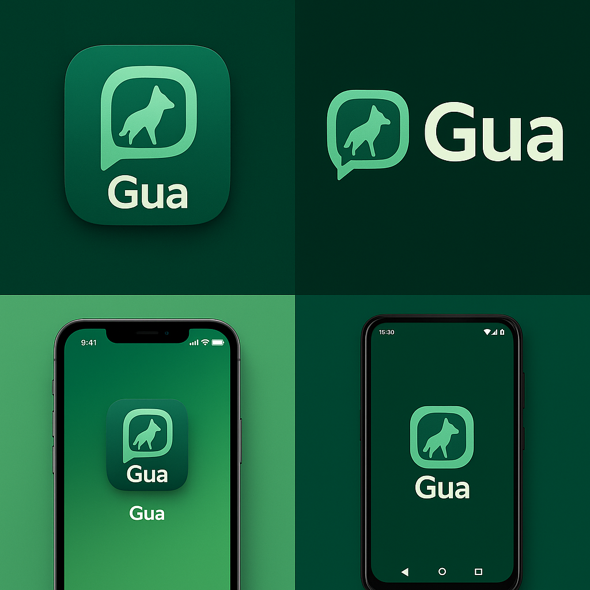

  <!-- Main Logo -->
  

<h1 align="center"Guá 🐺</h1>

  <i>Comunicação descentralizada, segura e feita para o Brasil</i>

  <!-- Guará wolf image -->
  

Gua 🐺 (inspired by the lobo-guará, maned wolf of Brazil) is a sovereignty-first, open-source communication ecosystem built on the Matrix protocol.

Our mission is to provide secure, performant, and accessible chat for everyone — from everyday users seeking a WhatsApp-like experience, to organizations and governments that need the flexibility of Slack/Discord-style collaboration.