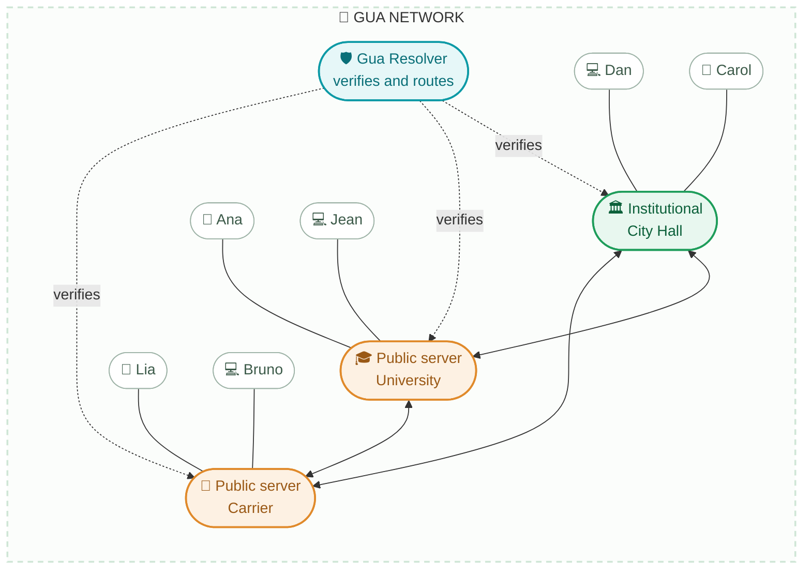

<h1 href="https://gua.global/about" align="center">Gua</h1>

  

  <strong>Comunicação descentralizada, segura e livre</strong> 
  <em>Decentralized, secure and free communication</em>

  
  
  

---

    <h3><a href="https://gua.global/about">Learn more about Gua</a></b>

 

Gua is a **prototype of a private, decentralized, federated messenger** built on the open [Matrix protocol](https://matrix.org). The idea is simple: chatting should feel as easy as in any modern app, phone sign-in, finding your friends, end-to-end encryption, no ads, but in a **decentralized way**, without a single big-tech company owning the whole network.

It works like a normal modern messenger. Behind the scenes, it's something different.

---

  

<em>Named after the <strong>lobo-guará</strong>, the maned wolf of Brazil. An animal that roams long distances, lives in no pack, and answers to no owner</em>

---

    <h3>Why Gua exists</h3>

Most of our conversations now live inside closed platforms, where one company controls the app, the servers, the rules, the code and your data. That creates dependency and fragility: the platform can change the rules overnight, mine your information to train AI models, block accounts, or shut a service down, and you have little real control.

Open source alone doesn't fix this. An app can have open code and still run on a **centralized network** where accounts, contact discovery, routing and operation all flow through infrastructure owned by one organization (e.g. [Signal](https://signal.org)). Better than a closed commercial platform, but still a single center of control.

Gua asks a different question: **what if you had a simple, modern-messenger experience, open code, end-to-end encryption, on a network that doesn't need to belong to any single company, foundation or provider?**

The vision is an open foundation for secure communication between people, communities, organizations, universities, local governments and institutions that need **digital sovereignty**, without giving up a simple experience for the everyday user. Gua is an open, federated, secure network: easy enough that people never have to think about it, and open enough that institutions can take part without handing all control to a central platform.

    <h3>How the federation works
</h3>

Gua is designed so that different organizations, such as universities, carriers and public institutions, can each run a trusted server on the same network. A small service called the Gua Resolver helps the app find the right server and confirms that it is trusted. That keeps the network open and safe at the same time.

```mermaid
graph TB
  subgraph NET["🐺 GUA NETWORK"]
    direction TB
    R(["🛡️ Gua Resolver<br/>verifies and routes"])
    INST(["🏛️ Institutional<br/>City Hall"])
    UNI(["🎓 Public server<br/>University"])
    CAR(["📡 Public server<br/>Carrier"])

    R -. verifies .-> INST
    R -. verifies .-> UNI
    R -. verifies .-> CAR

    INST <--> UNI
    UNI <--> CAR
    INST <--> CAR

    Dan(["💻 Dan"]) --- INST
    Carol(["📱 Carol"]) --- INST
    Ana(["📱 Ana"]) --- UNI
    Jean(["💻 Jean"]) --- UNI
    Lia(["📱 Lia"]) --- CAR
    Bruno(["💻 Bruno"]) --- CAR
  end

  classDef res fill:#e6f7f8,stroke:#0d9aa6,stroke-width:2px,color:#0a6f78;
  classDef inst fill:#e8f7ef,stroke:#1f9d5b,stroke-width:2px,color:#0c603a;
  classDef pub fill:#fdf1e3,stroke:#e08a2b,stroke-width:2px,color:#9a5916;
  classDef user fill:#ffffff,stroke:#9fb4a8,stroke-width:1px,color:#3c5a49;

  class R res;
  class INST inst;
  class UNI,CAR pub;
  class Dan,Carol,Ana,Jean,Lia,Bruno user;

  style NET fill:#fbfdfb,stroke:#cfe6d6,stroke-width:2px,stroke-dasharray:6 5;
```

In a **centralized** app, everyone depends on the same company's servers. In a **federated** network, many servers share one network. Each server is run by a trusted organization, community or institution. It works the way email does: accounts on different providers can still write to each other. In Gua, those conversations are end-to-end encrypted.

Gua does **not** let any unknown server join the network. The goal is a secure network where trust can be checked, not assumed.

The network's "front door" is a small service called the [**Gua Resolver**](https://github.com/Gua-ra/gua-resolver). Before you sign in, the app asks the resolver which server holds your account. The resolver also gives the app the list of trusted servers. It does not choose who is on that list. The network's published rules decide that, and anyone can read them. The resolver does not run the network, and it never signs you in. It helps answer three questions:

1. **Which server** holds this account?
2. **Is that server** a trusted member of the Gua network?
3. **Are the rules** for placing new accounts on servers public, so anyone can check them?

The result: decentralization without complexity, independence combined with trust.

Today, one operator runs every part of the prototype. The design is built so that this changes. The goal is a network where different organizations each run their own trusted server.

The [Gua identity and federation guide](https://github.com/Gua-ra/gua-resolver/blob/main/docs/architecture/gua-identity-and-federation.md) explains the design behind this. It separates what is built today from what is still the target.

## Project / ecosystem

All of Gua is open source, like the rest of the Matrix ecosystem. Everything lives under [**github.com/Gua-ra**](https://github.com/Gua-ra).

| Repository | What it is |
| --- | --- |
| [**gua-resolver**](https://github.com/Gua-ra/gua-resolver) | The network's "front door": tells the app which trusted server holds an account, and keeps the list of trusted servers. |
| [**gua-web**](https://github.com/Gua-ra/gua-web) | Web client. |
| [**gua-ios**](https://github.com/Gua-ra/gua-ios) | iOS client. |
| [**identity-service**](https://github.com/Gua-ra/identity-service) | The service that handles sign-up, finding contacts and sign-in in the prototype today. |
| [**gua-auth-service**](https://github.com/Gua-ra/gua-auth-service) | Authentication service. |
| [**gua-idp-web**](https://github.com/Gua-ra/gua-idp-web) | Sign-in / identity web UI. |
| [**gua-branding**](https://github.com/Gua-ra/gua-branding) | Brand assets. |

**How it fits together:**

- **Clients**: `gua-web`, `gua-ios`:  the apps people use.
- **Federation & trust**: `gua-resolver`: points the app to the server that holds an account, and checks which servers are trusted.
- **Identity & sign-in**: `identity-service`, `gua-auth-service`, `gua-idp-web`: sign-up, finding contacts, sign-in and the sign-in screens. Today, one operator runs all of them for the whole prototype. In the target design, each server signs in its own accounts.
- **Brand & deployment**: `gua-branding`, `gua-deploy`.

## Status

Gua is at the **prototype** stage. Features may change, break or be incomplete, and it is **not yet meant to be critical infrastructure**. Personal use is designed to stay **free**.

## Contact

- **General contact:** [contact@gua.global](mailto:contact@gua.global)

---

<em>Built on the open <a href="https://matrix.org">Matrix protocol</a>. Free, independent, owned by no one. 🐺</em>

