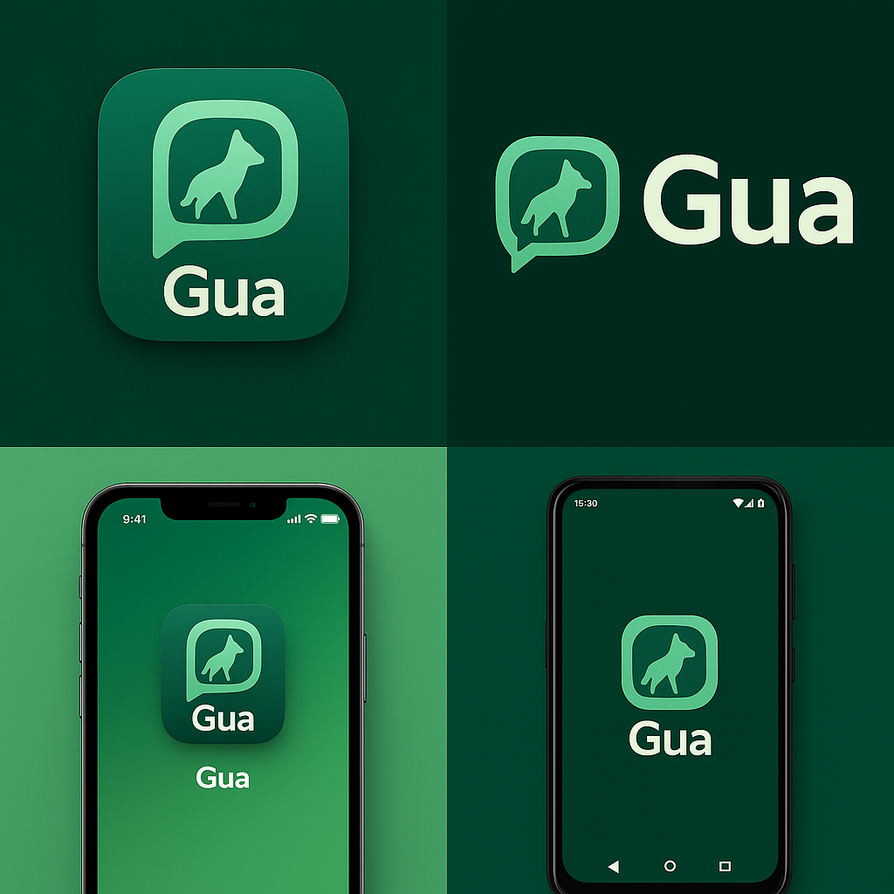

  

<h1 align="center">Gua 🐺</h1>

  <i>Comunicação descentralizada, segura e livre</i>

---

  

  <b>Gua (Gua-ra) 🐺</b> (inspired by the lobo-guará, maned wolf of Brazil) is a sovereignty-first, federated open-source communication ecosystem built on the Matrix protocol.

  Gua's goal is to provide a robust, secure, scalable, and accessible modern chat platform for everyone. We pair the casual utility of an everyday chat app with the robust workspace of an enterprise collaboration tool, providing individuals and organizations a secure environment entirely idendependent of Big Tech control.

